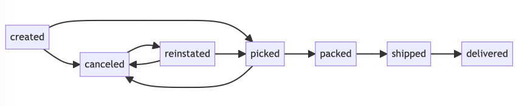
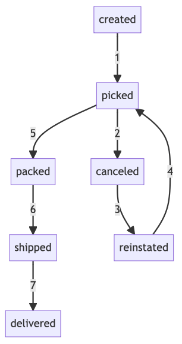

_Tiny, no frills finite state machine for Go_


[](https://pkg.go.dev/github.com/hishamk/statetrooper?tab=doc)

[](https://raw.githack.com/wiki/hishamk/statetrooper/coverage.html)
[](https://goreportcard.com/report/github.com/hishamk/statetrooper)
[](https://img.shields.io/github/license/hishamk/statetrooper) 

StateTrooper is a Go package that provides a finite state machine (FSM) for managing states. It allows you to define and enforce state transitions based on predefined rules.

> ⚠️ Please keep in mind that StateTrooper is still under active development
> and therefore full backward compatibility is not guaranteed before reaching v1.0.0.

## Features

- Generic support for different comparable types.
- Transition history with metadata. History size configurable.
- Thread safe.
- Super minimal - no triggers/events or actions/callbacks. For my use case I just needed a structured, serializable way to constrain and track state transitions.
- Is able to generate [Mermaid.js](https://mermaid.js.org) diagram descriptions for the transition rules and transition history.

_Rules diagram:_



_Transition history diagram:_



## Installation

To install StateTrooper, use the following command:

```shell
go get github.com/hishamk/statetrooper
```

## Usage

Import the `statetrooper` package into your Go code:

```go
import "github.com/hishamk/statetrooper"
```

Create an instance of the FSM with the desired state enum type, initial state and maximum transition history size:

```go
fsm := statetrooper.NewFSM[CustomStateEnum](CustomStateEnumA, 10)
```

Add valid transitions between states. AddRule takes variadic parameters for the allowed states:

```go
// Created -> Picked or Canceled
AddRule(StatusCreated, StatusPicked, StatusCanceled)
// Picked -> Packed or Canceled
AddRule(StatusPicked, StatusPacked, StatusCanceled)
// Packed -> Shipped
AddRule(StatusPacked, StatusShipped)
// Shipped -> Delivered
AddRule(StatusShipped, StatusDelivered)
// Canceled -> Reinstated
AddRule(StatusCanceled, StatusReinstated)
// Reinstated -> Picked or Canceled
AddRule(StatusReinstated, StatusPicked, StatusCanceled)
```

Check if a transition from the current state to the target state is valid:

```go
canTransition := fsm.CanTransition(targetState)
```

Transition the entity from the current state to the target state with no metadata:

```go
newState, err := fsm.Transition(targetState, nil)
if err != nil {
    // Handle the error
}
```

Transition the entity from the current state to the target state with metadata:

```go
newState, err := fsm.Transition(
	CustomStateEnumB,
	map[string]string{
		"requested_by":  "Mahmoud",
		"logic_version": "1.0",
	})
```

Generate Mermaid.js rules diagram:

```go
diagram, _ :=order.State.GenerateMermaidRulesDiagram()
```

_In order to generate a diagram, the states type must have a String() method._ Ensure that the formatted string returned does not contain any invalid characters for Mermaid.

_Use the generated Mermaid code with your Mermaid visualizer to generate the diagram._

```markdown
graph LR;
shipped;
canceled;
reinstated;
created;
picked;
packed;
created --> picked;
created --> canceled;
picked --> packed;
picked --> canceled;
packed --> shipped;
shipped --> delivered;
canceled --> reinstated;
reinstated --> picked;
reinstated --> canceled;
```


Generate Mermaid.js transition history diagram:

```go
diagram, _ :=order.State.GenerateMermaidTransitionHistoryDiagram()
```

```markdown
graph TD;
packed;
shipped;
delivered;
created;
picked;
canceled;
reinstated;
created -->|1| picked;
picked -->|2| canceled;
canceled -->|3| reinstated;
reinstated -->|4| picked;
picked -->|5| packed;
packed -->|6| shipped;
shipped -->|7| delivered;
```


## Benchmarks

| Benchmark                    | Operations | Time per Operation | Memory Allocated per Operation |
| ---------------------------- | ---------- | ------------------ | ------------------------------ |
| Benchmark_singleTransition   | 5,166,985  | 273.8 ns/op        | 314 allocs/op                  |
| Benchmark_twoTransitions     | 2,835,214  | 513.6 ns/op        | 577 allocs/op                  |
| Benchmark_accessCurrentState | 75,695,847 | 14.36 ns/op        | 0 allocs/op                    |
| Benchmark_accessTransitions  | 39,356,628 | 28.74 ns/op        | 48 allocs/op                   |
| Benchmark_marshalJSON        | 1,000,000  | 1,174 ns/op        | 384 allocs/op                  |
| Benchmark_unmarshalJSON      | 318,949    | 3,741 ns/op        | 1,240 allocs/op                |

## Example

Here's an example usage with a custom entity struct and state enum:

```go
type OrderStatusEnum string

// Enum values for the custom entity
const (
	StatusCreated    OrderStatusEnum = "created"
	StatusPicked     OrderStatusEnum = "picked"
	StatusPacked     OrderStatusEnum = "packed"
	StatusShipped    OrderStatusEnum = "shipped"
	StatusDelivered  OrderStatusEnum = "delivered"
	StatusCanceled   OrderStatusEnum = "canceled"
	StatusReinstated OrderStatusEnum = "reinstated"
)

// Order represents a custom entity with its current state
type Order struct {
	State *statetrooper.FSM[OrderStatusEnum]
}

func main() {
	// Create a new order with the initial state
	order := &Order{State: statetrooper.NewFSM[OrderStatusEnum](StatusCreated, 10)}

	// Define the valid state transitions for the order

	// Created -> Picked or Canceled
	order.State.AddRule(StatusCreated, StatusPicked, StatusCanceled)
	// Picked -> Packed or Canceled
	order.State.AddRule(StatusPicked, StatusPacked, StatusCanceled)
	// Packed -> Shipped
	order.State.AddRule(StatusPacked, StatusShipped)
	// Shipped -> Delivered
	order.State.AddRule(StatusShipped, StatusDelivered)
	// Canceled -> Reinstated
	order.State.AddRule(StatusCanceled, StatusReinstated)
	// Reinstated -> Picked or Canceled
	order.State.AddRule(StatusReinstated, StatusPicked, StatusCanceled)

	// Check if a transition is valid
	canTransition := order.State.CanTransition(StatusPicked)
	fmt.Printf("Can transition to %s: %t\n", StatusPicked, canTransition)

	// Transition to picked
	_, err := order.State.Transition(StatusPicked, nil)
	if err != nil {
		fmt.Println("Transition error:", err)
	} else {
		fmt.Println("Transition successful. Current state:", order.State.CurrentState())
	}

	// Check if a transition to canceled is valid
	canTransition = order.State.CanTransition(StatusCanceled)
	fmt.Printf("Can transition to %s: %t\n", StatusCanceled, canTransition)

	// Transition to canceled
	_, err = order.State.Transition(StatusCanceled, nil)
	if err != nil {
		fmt.Println("Transition error:", err)
	} else {
		fmt.Println("Transition successful. Current state:", order.State.CurrentState())
	}

	// Check if we can resinstate the order
	canTransition = order.State.CanTransition(StatusReinstated)
	fmt.Printf("Can transition to %s: %t\n", StatusReinstated, canTransition)

	// Transition to reinstated
	_, err = order.State.Transition(StatusReinstated, nil)
	if err != nil {
		fmt.Println("Transition error:", err)
	} else {
		fmt.Println("Transition successful. Current state:", order.State.CurrentState())
	}

	// Transition to picked
	_, err = order.State.Transition(StatusPicked, nil)
	if err != nil {
		fmt.Println("Transition error:", err)
	} else {
		fmt.Println("Transition successful. Current state:", order.State.CurrentState())
	}

	// Transition to packed
	_, err = order.State.Transition(StatusPacked, nil)
	if err != nil {
		fmt.Println("Transition error:", err)
	} else {
		fmt.Println("Transition successful. Current state:", order.State.CurrentState())
	}

	// Transition to shipped
	_, err = order.State.Transition(
		StatusShipped,
		map[string]string{
			"carrier":         "Aramex",
			"tracking_number": "1234567890",
		})

	if err != nil {
		fmt.Println("Transition error:", err)
	} else {
		fmt.Println("Transition successful. Current state:", order.State.CurrentState())
	}

	// Transition to delivered
	_, err = order.State.Transition(StatusDelivered, nil)
	if err != nil {
		fmt.Println("Transition error:", err)
	} else {
		fmt.Println("Transition successful. Current state:", order.State.CurrentState())
	}

	// print the current FSM data
	fmt.Println("Current FSM data:", order.State)
}
```

Note that states can be defined using any comparable type, such as strings, int, etc e.g.:

```go
// CustomStateEnum represents the state enum for the custom entity
type CustomStateEnum int

// Enum values for the custom entity
const (
	CustomStateEnumA CustomStateEnum = iota
	CustomStateEnumB
	CustomStateEnumC
)

func (e CustomStateEnum) String() string {
	return fmt.Sprintf("%d", e)
}
```

## Serialization

Current state, transition history and any metadata can be marshalled into JSON.

```go
json, err := json.Marshal(order.State)
if err != nil {
	fmt.Println("JSON error:", err)
} else {
	fmt.Println("Current FSM data as JSON:", string(json))
}
```

Output:

```json
{
  "current_state": "delivered",
  "transitions": [
    {
      "from_state": "created",
      "to_state": "picked",
      "timestamp": "2023-06-18T11:44:42.776422+03:00",
      "metadata": null
    },
    {
      "from_state": "picked",
      "to_state": "canceled",
      "timestamp": "2023-06-18T11:44:42.77643+03:00",
      "metadata": null
    },
    {
      "from_state": "canceled",
      "to_state": "reinstated",
      "timestamp": "2023-06-18T11:44:42.776435+03:00",
      "metadata": null
    },
    {
      "from_state": "reinstated",
      "to_state": "picked",
      "timestamp": "2023-06-18T11:44:42.77644+03:00",
      "metadata": null
    },
    {
      "from_state": "picked",
      "to_state": "packed",
      "timestamp": "2023-06-18T11:44:42.776442+03:00",
      "metadata": null
    },
    {
      "from_state": "packed",
      "to_state": "shipped",
      "timestamp": "2023-06-18T11:44:42.776451+03:00",
      "metadata": {
        "carrier": "Aramex",
        "tracking_number": "1234567890"
      }
    },
    {
      "from_state": "shipped",
      "to_state": "delivered",
      "timestamp": "2023-06-18T11:44:42.776454+03:00",
      "metadata": null
    }
  ]
}
```

## License

This package is licensed under the MIT License. See the [LICENSE](LICENSE.md) file for details.

## Contributing

Thank you for your interest in contributing! Feel free to PR bug fixes, optimisations and documentation improvements. For new features or functional alterations, please open an issue for discussion prior to submitting a PR.

## Logo

Synthwave title text generated courtesy of [Text Effect](https://www.textstudio.com/).

Trooper Gopher generated via midjourney prompt: _a photorealistic rendering of the Go/Golang gopher mascot holding a sheriff's badge. Color palette similar to mascot's (baby blue or light beige). Buck teeth. Round glasses. Big smile. Transparent background. --v 5_
